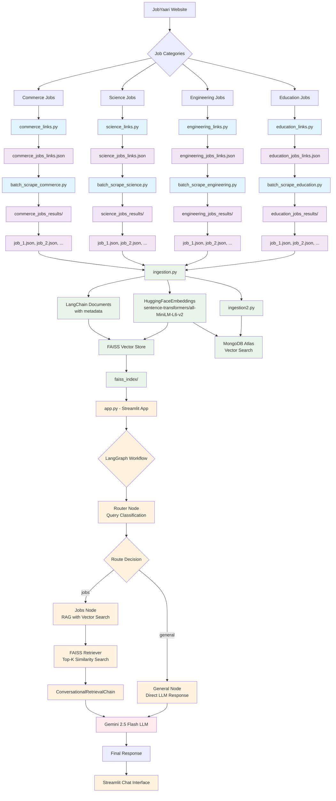

# JobYaari Chatbot Architecture

This diagram shows the complete flow from web scraping to the intelligent chatbot implementation.

## Architecture Components

### 🕷️ **Data Collection Phase**
- Selenium-based scrapers for each job category
- Batch processing for detailed job extraction
- JSON storage organized by category

### 🔄 **Data Processing Phase** 
- Document creation with LangChain
- HuggingFace embeddings generation
- FAISS/MongoDB vector storage

### 🤖 **Chatbot Phase**
- LangGraph workflow orchestration
- Intelligent query routing
- RAG implementation with vector search
- Gemini LLM integration